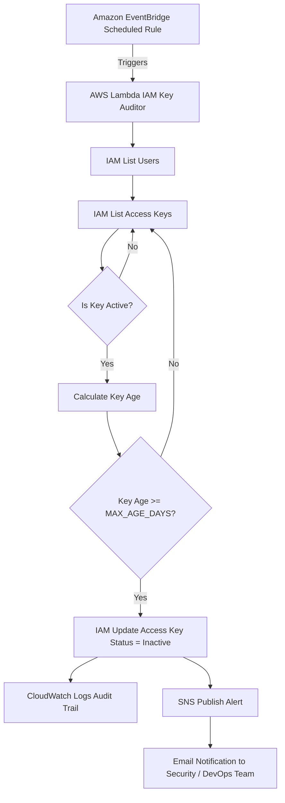

# 🔐 IAM Access Key Security Automation (Lower Environments Only)

> Automated detection, alerting, and deactivation of stale IAM access keys using AWS Lambda, EventBridge, SNS, and IAM.

---

# 📌 Overview

This project implements an **end-to-end AWS security automation** that continuously audits IAM access keys and automatically deactivates keys that exceed a defined age threshold. It also sends **real-time notifications** to security and DevOps teams whenever an action is taken.

The solution is intentionally designed for **lower environments only** (sandbox, dev, pre-prod) where developers often generate temporary IAM access keys and forget to rotate or delete them — creating potential security risks.

---

# 🚨 Why This Matters

In real-world cloud environments:

- Developers create IAM access keys for testing
- Keys remain active longer than intended
- Long-lived credentials increase the risk of:
  - Credential leakage
  - Unauthorized access
  - Audit and compliance failures

Manual reviews do not scale.

This automation ensures **security hygiene through automated enforcement**.

---

# ❗ Important Disclaimer

⚠️ **DO NOT USE IN PRODUCTION ENVIRONMENTS**

Production applications or services may rely on IAM access keys.  
Automatic deactivation could cause **service disruption**.

Recommended environments:

- Sandbox
- Development
- Pre-production
- Security demonstrations

---

# 🏗️ Architecture



---

# 🧠 Design Principles

- Automation-first security
- Least privilege recommended
- No hardcoded credentials
- Serverless architecture
- Audit-friendly implementation

---

# 🧩 AWS Services Used

| Service | Purpose |
|------|------|
| IAM | User and access key management |
| Lambda | Core automation engine |
| EventBridge | Scheduled execution |
| SNS | Alerting and notifications |
| CloudWatch Logs | Execution visibility |

---

# ⚙️ Execution Flow

1. EventBridge triggers the Lambda function on a schedule
2. Lambda lists IAM users
3. Lambda retrieves access keys for each user
4. Active keys are evaluated based on age
5. Keys exceeding the threshold are automatically deactivated
6. Actions are logged to CloudWatch
7. SNS sends an alert email to the DevOps/Security team

---

# 🧪 Testing Configuration

For testing purposes:

```bash
MAX_AGE_DAYS=0
```

This forces immediate deactivation of any active key.

Typical security policy example:

```bash
MAX_AGE_DAYS=90
```

---

# 🧑‍💻 Lambda Responsibilities

The Lambda function performs the following:

- Lists IAM users
- Retrieves access keys
- Identifies active keys
- Calculates key age
- Deactivates stale keys
- Sends notifications
- Writes logs to CloudWatch

Security notes:

- No credentials stored in code
- Uses IAM execution role

---

# 🔐 Required IAM Permissions

```json
{
  "iam:ListUsers",
  "iam:ListAccessKeys",
  "iam:UpdateAccessKey",
  "sns:Publish",
  "logs:CreateLogGroup",
  "logs:CreateLogStream",
  "logs:PutLogEvents"
}
```

Best practice: implement **least privilege IAM policies**.

---

# ⏱️ EventBridge Scheduler

Testing configuration:

```
rate(1 minute)
```

Typical real-world configuration:

```
cron(0 2 * * ? *)
```

Runs once daily.

---

# 📧 Notification Example

```
Subject: IAM Access Key Audit Alert

Disabled IAM access keys:

lambda-user (AKIAxxxx) - 0 days
```

---

# 📊 Observability

CloudWatch Logs provide:

- Execution details
- Keys evaluated
- Keys deactivated

SNS provides:

- Immediate security alerts

---

# 🏆 Key Outcomes

- Automated IAM credential lifecycle enforcement
- Reduced manual security checks
- Implemented practical cloud security automation
- Serverless and scalable architecture

---

# 🎯 Skills Demonstrated

- AWS IAM security
- Serverless automation
- Event-driven architecture
- Cloud security best practices
- Observability and auditing

---

# 👨‍💻 Notes

This project demonstrates how DevOps and SRE teams can **reduce credential risk through automation** instead of relying on manual reviews.

Security should be enforced by **systems, not reminders**.

---

⭐ If you find this useful, consider starring the repository.
